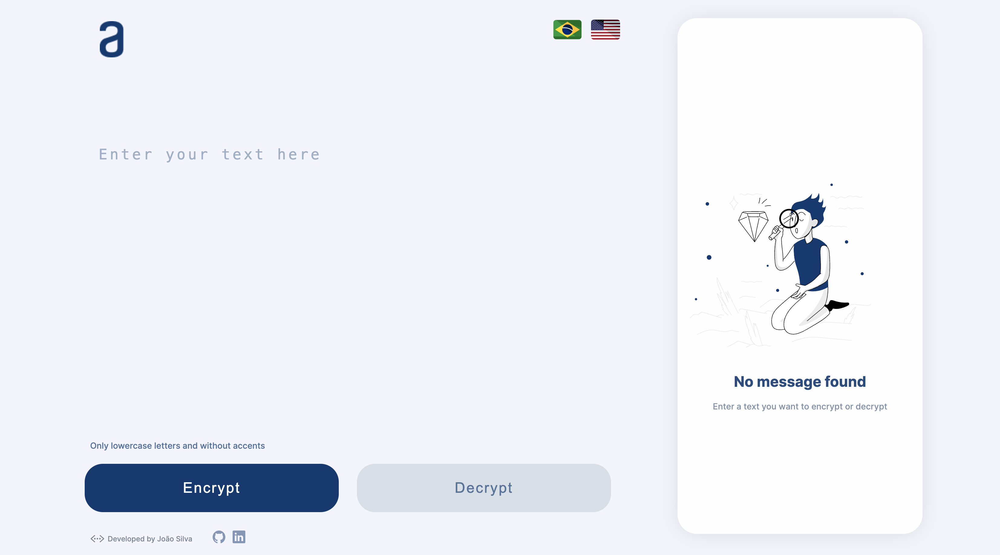

# Project: Message Decoder

<h3>Project Description:</h3>

I have developed an application capable of encrypting and decrypting messages, allowing for secure information exchange between individuals who share the encoding secret. We use a specific set of encryption "keys":

<ul>
 <li>"e" has been converted to "enter"</li>
 <li>"i" has been converted to "imes"</li>
 <li>"a" has been converted to "ai"</li>
 <li>"o" has been converted to "ober"</li>
 <li>"u" has been converted to "ufat"</li>
 </ul>
 
<h3>Project Requirements:</h3>
<ol>
 <li>Exclusive operation with lowercase letters.</li>
 <li>Absence of accented letters or special characters.</li>
 <li>Ability to convert a word to its encrypted version and vice versa.</li>
 </ol>
 
<h3>For example:</h3>

"family" has been transformed into "faimimesly"

"faimimesly" has been reversed to "family"

<h4>Furthermore, this page provides fields for entering the text to be encrypted or decrypted, with the option for the user to choose between both functionalities. The result is instantly displayed on the screen.</h4>

Additional Features:

We have implemented a button to copy the encrypted/decrypted text to the clipboard, facilitating the sharing of messages.

<h3><a href="https://jcizidrosilva.github.io/projeto-decodificador/" target="_blank">Link for the project</a></h3>

